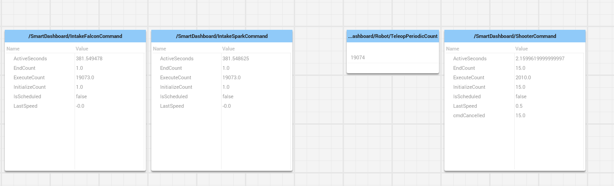
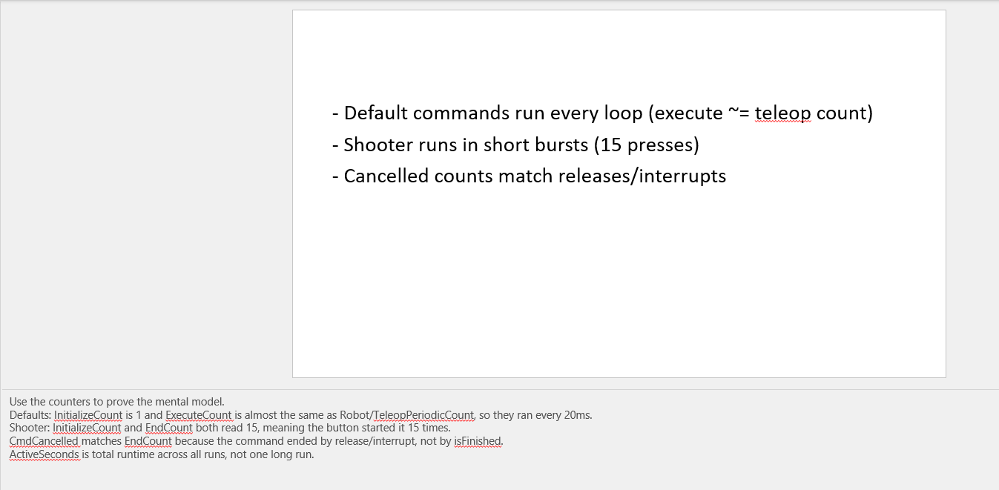

# Command-Based Control Flow

## Title
- Command-Based Control Flow
- How this robot code actually runs
- Demo project: testDemoBoardCommandBased

::: notes
Introduce the goal: make command-based feel like a simple control loop with organized wiring.
Set expectations: no new theory, just the path from controller input to motors.
:::

## The Big Picture
- Robot code runs in a 20ms loop
- We do not write the loop; WPILib does
- We wire behaviors into that loop

::: notes
Stress that the loop already exists and never stops during a match.
Our job is to plug in behavior that runs inside it.
:::

## Three Layers
- Robot = heartbeat
- RobotContainer = wiring closet
- Subsystems = hardware
- Commands = actions

::: notes
Use a house analogy: heartbeat (robot), wiring closet (container), appliances (subsystems), actions (commands).
:::

## Boot Sequence
- Main starts WPILib
- Robot is constructed
- RobotContainer builds subsystems and bindings

::: notes
Point out this only happens once at startup; it is not the 20ms loop yet.
:::

## The Scheduler Starts Here
- Every 20ms, Robot.robotPeriodic() runs
- It calls CommandScheduler.getInstance().run()
- That one call drives all commands

::: notes
Show that the scheduler is invoked from the periodic loop, not magic.
This is the bridge between WPILib's loop and our commands.
:::

## Code Walk: The 20ms Loop
```java
@Override
public void robotPeriodic() {
  CommandScheduler.getInstance().run();
}
```
`src/main/java/frc/robot/Robot.java`

::: notes
Show them this is the only required line to make command-based run every loop.
:::

## What Happens Each Pass
- Poll triggers and update button edges
- Schedule/cancel commands based on triggers
- Enforce subsystem requirements and defaults
- Run command lifecycle (init/execute/end)
- Run subsystem periodic updates

::: notes
Major chunks inside a pass are: input evaluation, scheduling decisions, command lifecycle, and subsystem periodic.
Trigger polling covers whileTrue/onTrue/onFalse, including edge detection on transitions.
Scheduling enqueues new commands, cancels ones whose triggers fell, and can interrupt existing commands that conflict on requirements.
Subsystem requirements ensure only one command controls a subsystem at a time; if nothing is scheduled for a subsystem, its default command is scheduled.
Lifecycle calls initialize once, execute every pass, and end on completion or interruption.
Subsystem periodic methods are also run each pass so hardware outputs are updated.
:::

## Our Buttons Right Now
- B button: run shooter while held
- X button: run shooter for 0.5 seconds
- Left stick: intake falcon default
- Right stick: intake spark default

::: notes
Tell them: these are the actual bindings in this project, not a generic example.
:::

## Code Walk: Shooter Bindings
```java
m_driverController.b().whileTrue(
  new ShooterCommand(m_ShooterSubsystem, m_shooterSpeedSupplier));
m_driverController.x().onTrue(
  new ShooterCommand(m_ShooterSubsystem, m_shooterSpeedSupplier)
    .withTimeout(0.5));
```
`src/main/java/frc/robot/RobotContainer.java`

::: notes
whileTrue keeps the command scheduled for as long as the button is held.
onTrue schedules the command once when the button transitions from not pressed to pressed.
That means the whileTrue command stops immediately on release, but onTrue keeps running until it finishes or is interrupted.
withTimeout(0.5) is a decorator that ends the command after 0.5 seconds, even if it is still scheduled.
onTrue does not specify how the command ends; it only controls the start.
Without withTimeout, this ShooterCommand would run forever because isFinished() returns false.
:::

## Code Walk: Intake Defaults
```java
m_intakeFalconSubsystem.setDefaultCommand(
  new IntakeFalconCommand(m_intakeFalconSubsystem, m_intakeFalconSpeedSupplier));
m_intakeSparkSubsystem.setDefaultCommand(
  new IntakeSparkCommand(m_intakeSparkSubsystem, m_intakeSparkSpeedSupplier));
```
`src/main/java/frc/robot/RobotContainer.java`

::: notes
Default commands run whenever no other command is using that subsystem.
:::

## Dashboard Evidence (Run 1)

- Defaults run every loop (execute ~= teleop count)
- Shooter runs in short bursts (15 presses)
- Cancelled counts match releases/interrupts

::: notes
Use the counters to prove the mental model.
Defaults: InitializeCount is 1 and ExecuteCount is almost the same as Robot/TeleopPeriodicCount, so they ran every 20ms.
Shooter: InitializeCount and EndCount both read 15, meaning the button started it 15 times.
CmdCancelled matches EndCount because the command ended by release/interrupt, not by isFinished.
ActiveSeconds is total runtime across all presses, not one long run.
:::

## Dashboard Evidence (Run 2)

- Defaults run every loop (execute ~= teleop count)
- Shooter runs in short bursts (button driven)
- ActiveSeconds is total across presses

::: notes
Use this second run to show repeatability across tests.
The exact counts will vary, but the ratios should stay the same.
:::

## Dashboard Takeaways
- Default commands run every loop (execute ~= teleop count)
- Button command like Shooter runs in short bursts (15 presses)
- Cancelled counts match releases/interrupts

::: notes
Use the counters to prove the mental model.
Defaults command InitializeCount is 1 and ExecuteCount is almost the same as Robot/TeleopPeriodicCount, so they ran every 20ms.
Button command Shooter: InitializeCount and EndCount both read 15, meaning the button started it 15 times.
CmdCancelled matches EndCount because the command ended by release/interrupt, not by isFinished.
ActiveSeconds is total runtime across all presses, not one long run.
:::

## Subsystems Own Motors
- Subsystems are the only place motor code lives
- Commands ask subsystems to do work
- Keeps hardware logic in one file

::: notes
This helps avoid duplicate motor control spread across files.
:::

## Code Walk: Command Gets Speed
```java
@Override
public void execute() {
  double speed = m_speedSupplier.getAsDouble();
  m_subsystem.setShooterSpeed(speed);
}
```
`src/main/java/frc/robot/commands/ShooterCommand.java`

::: notes
The command execute method gets the speed value from the supplier and gives it to the subsystem by calling setShooterSpeed.
:::

## Scheduler Sequence (One Pass)
- Robot.robotPeriodic calls CommandScheduler.run()
- Scheduler polls triggers from RobotContainer bindings
- ShooterCommand execute runs if B/X scheduled
- ShooterSubsystem periodic applies mShooterSpeed

`src/main/java/frc/robot/Robot.java`
`src/main/java/frc/robot/RobotContainer.java`
`src/main/java/frc/robot/commands/ShooterCommand.java`
`src/main/java/frc/robot/subsystems/ShooterSubsystem.java`

::: notes
Concrete sequence for this project: Robot.robotPeriodic calls CommandScheduler.run each 20ms.
The scheduler reads trigger state from RobotContainer bindings (B whileTrue, X onTrue).
If a trigger is active, it schedules ShooterCommand and calls its execute method this pass.
After commands run, ShooterSubsystem periodic runs and pushes the stored speed to the motor.
This is the exact timing order to remember: scheduler -> command execute -> subsystem periodic.
:::

## Code Walk: Subsystem Stores Speed
```java
private double mShooterSpeed = 0;

public void setShooterSpeed(double motorSpeed) {
  mShooterSpeed = motorSpeed;
}
```
`src/main/java/frc/robot/subsystems/ShooterSubsystem.java`

::: notes
That subsystem method saves the value.
:::

## Code Walk: Periodic Writes Motor
```java
private final SparkMax mShooterMotor =
    new SparkMax(Constants.ShooterCanID, MotorType.kBrushless);

public void periodic() {
  mShooterMotor.set(mShooterSpeed);
}
```
`src/main/java/frc/robot/subsystems/ShooterSubsystem.java`

::: notes
The subsystem periodic routine uses the saved speed value to set the actual hardware motor speed.
:::

## Why This Style Helps
- Buttons in one place
- Hardware in one place
- Commands are reusable
- Multiple systems can run together safely

::: notes
This is the maintainability pitch: fewer bugs and easier testing.
:::

## Simple Mental Model
- Command = repeated function
- Subsystem = robot part
- Scheduler = loop that picks functions

::: notes
Encourage them to keep this model in their head during coding.
:::

## Next Steps for Us
- Add an autonomous command
- Add safety timeouts
- Add sensor feedback

::: notes
Invite students to own one of these next steps as practice.
:::
